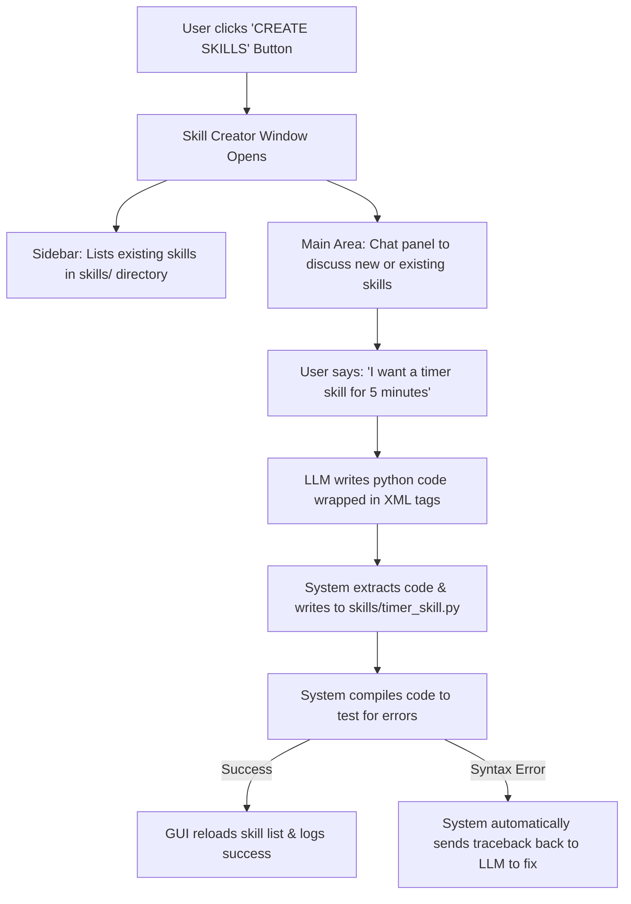

# Skill Creator System — Implementation Plan

> **Goal**: Implement an interactive, code-free "Skill Creator" system. Users will be able to click a "CREATE SKILLS" button, open a dedicated chat window, converse with the local LLM to describe what skill they want, and have the system automatically generate, compile, and register the skill file with zero coding required. The window will also list all current skills on the left, letting users edit (alter) or delete them in a single click.

---

## 1. Architectural Blueprint

### 1.1 The User Workflow


### 1.2 Key Components to Implement

1. **GUI trigger (`ui/dashboard.py`)**:
   - Add a new `CREATE SKILLS` button in the sidebar panel.
   - Wire this button to instantiate and open the `SkillCreatorWindow` CTk window.

2. **Skill Creator Window Class (`ui/skill_creator.py` - NEW)**:
   - A secondary `ctk.CTkToplevel` window.
   - **Left Panel (Sidebar)**:
     - Scrollable list of current skills read from the `skills/` directory.
     - "Alter" and "Delete" buttons displayed when a skill is selected.
   - **Right Panel (Main Area)**:
     - A dedicated chat history textbox showing the conversation with the LLM.
     - A text entry bar + "Send" button for chatting.
     - Progress/status logs displaying compiling/loading status.

3. **Creator LLM System Prompt (`config.py`)**:
   - Define a specialized system prompt template `SKILL_CREATOR_SYSTEM_PROMPT` containing guidelines for creating skills, the `BaseSkill` class blueprint, and formatting instructions.
   - Instruct the LLM to output the finalized code wrapped in `<skill_code>...</skill_code>` tags, and the suggested filename inside `<filename>...</filename>` tags.

4. **Code Generation & Verification Engine (`brain/skill_creator_engine.py` - NEW)**:
   - Extracts filenames and code blocks from the LLM's text output using regex.
   - Writes generated code to the `skills/` directory.
   - Compiles the generated file using `py_compile` to verify syntax.
   - Returns success or error tracebacks to the chat flow.

---

## 2. Technical Designs & Specifications

### 2.1 File Map

| File | Status | Description |
|---|---|---|
| `ui/skill_creator.py` | **NEW** | Contains the `SkillCreatorWindow` layout and event handlers (scrollable list, chat panel). |
| `brain/skill_creator_engine.py` | **NEW** | Handles parsing LLM outputs, writing files, and compiling/deleting skills. |
| `skills/__init__.py` | **MODIFY** | Add `reload_skills()` method to dynamically rebuild `SKILL_INSTANCES` and `OLLAMA_TOOLS` at runtime without restarting the main app. |
| `ui/dashboard.py` | **MODIFY** | Add "CREATE SKILLS" button to sidebar and link it to open the creator window. |
| `main.py` | **MODIFY** | Pass reference to models and dynamic reloading hook to the creator window. |
| `config.py` | **MODIFY** | Define `SKILL_CREATOR_SYSTEM_PROMPT` explaining code formatting rules. |

---

## 3. Step-by-Step Implementation Checklist

### Phase 1: Modify Configuration & System Prompt
- [ ] Add `SKILL_CREATOR_SYSTEM_PROMPT` to `config.py`.
  - The prompt must instruct the LLM to behave as a Python developer helper.
  - Detail `BaseSkill` abstract class structure, including properties (`name`, `description`, `parameters`, `filler_keywords`, `filler_phrases`) and the `execute` method.
  - Instruct the LLM to output code exactly wrapped in tags:
    ```xml
    <filename>skill_name_skill.py</filename>
    <skill_code>
    # Python code here
    </skill_code>
    ```
  - Tell the LLM that the user is a non-programmer, so it must handle all coding details, libraries, and imports, and respond only in friendly conversational English.

### Phase 2: Dynamic Skill Reloading
- [ ] Modify `skills/__init__.py` to support dynamic loading:
  - Extract the discovery loop into a reusable function `reload_skills()`.
  - The function must rebuild `SKILL_INSTANCES`, `TOOLS_REGISTRY`, and `OLLAMA_TOOLS` dynamically.
  - Export `reload_skills` so other classes can call it when a skill is created, modified, or deleted.

### Phase 3: Create the Skill Creator Engine
- [ ] Create `brain/skill_creator_engine.py`.
- [ ] Implement `extract_and_write_skill(llm_response_text: str) -> dict`:
  - Use regex to search for `<filename>(.*?)</filename>` and `<skill_code>(.*?)</skill_code>`.
  - If found, write the code content to `skills/{filename}`.
  - Run `py_compile` to verify syntax.
  - If compilation fails, return `{"success": False, "error": compile_error_traceback}`.
  - If compilation succeeds, trigger `reload_skills()`, and return `{"success": True, "filename": filename}`.
- [ ] Implement `delete_skill(skill_name: str) -> bool`:
  - Locate the skill file in the `skills/` directory (e.g. `skills/{name}_skill.py` or matching class file).
  - Delete the file, call `reload_skills()`, and return status.

### Phase 4: Build the GUI Layout
- [ ] Create `ui/skill_creator.py`.
- [ ] Implement the `SkillCreatorWindow(ctk.CTkToplevel)` class:
  - Add window geometries, grid configurations (left column for skills list, right column for chatbot).
  - **Left Section (Sidebar)**:
    - Label: "CURRENT ACTIVE SKILLS".
    - Scrollable frame showing clickable entries of loaded skills.
    - Buttons at the bottom of the list: "Alter Selected Skill" and "Delete Selected Skill".
  - **Right Section (Main Chat)**:
    - Textbox showing the LLM conversation dialogue.
    - Entry bar to type prompts.
    - "Send" button.
    - Progress indicator status bar.
- [ ] Wire chat inputs:
  - Maintain a thread-local chat history list `self.chat_history = [{"role": "system", "content": config.SKILL_CREATOR_SYSTEM_PROMPT}]`.
  - When the user clicks Send:
    1. Append user prompt to history and display in chat window.
    2. Query Ollama in a background thread to prevent UI freezing.
    3. Stream response tokens to the chat window.
    4. Once finished, parse output via `extract_and_write_skill()`.
    5. If a new skill was successfully written and compiled, update status bar to "Skill Created Successfully!" and refresh the left sidebar list.
    6. If compilation failed, automatically append the syntax error to `chat_history` as a system/user role notification (e.g., *"System: Compilation failed with error X. Please fix the syntax in the code."*), and request the LLM to write a corrected version.

### Phase 5: Integrate with Main Application
- [ ] Update `ui/dashboard.py` sidebar:
  - Add the `CREATE SKILLS` button below the mute controls.
  - Design with: `fg_color="#00B4D8"`, `hover_color="#0096B7"`.
- [ ] Update `main.py`:
  - Bind the `CREATE SKILLS` button command to open `SkillCreatorWindow`.
  - Pass necessary models/clients (e.g. `OllamaLLMClient` instance) to `SkillCreatorWindow` so it can communicate with Ollama directly.

### Phase 6: Verification & Testing
- [ ] Syntax check all modified and new files:
  ```bash
  venv\Scripts\python.exe -m py_compile main.py ui\dashboard.py ui\skill_creator.py brain\skill_creator_engine.py
  ```
- [ ] **Functional Test 1: Create a Skill**:
  - Open the Skill Creator chat window.
  - Type: *"Create a skill called greet_user that prints 'Hello John!' when triggered."*
  - Verify that:
    1. The LLM streams a response with `<filename>greet_skill.py</filename>` and a python class inheriting `BaseSkill`.
    2. The engine parses the tags, saves `skills/greet_skill.py`, and compiles it successfully.
    3. The left sidebar updates automatically to list `greet_user`.
- [ ] **Functional Test 2: Alter a Skill**:
  - Click on `greet_user` in the left sidebar, click "Alter".
  - Verify it populates the chat with the skill context.
  - Type: *"Change it so that it prints 'Good morning John!' instead."*
  - Verify it correctly updates the file and compiles.
- [ ] **Functional Test 3: Delete a Skill**:
  - Click on `greet_user`, click "Delete".
  - Confirm deletion.
  - Verify that the file `skills/greet_skill.py` is removed, and the left sidebar list updates immediately.
